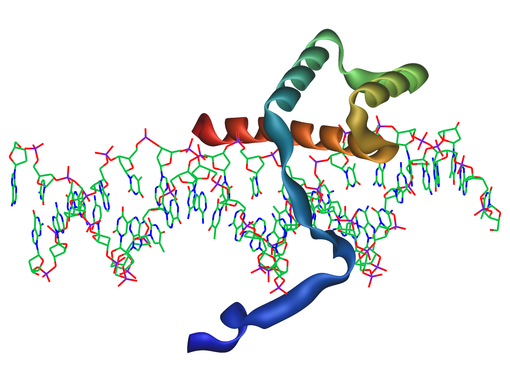

# Homeobox_dataset

Dataset for phylogenetic lab in Bio 224

Data source: http://homeodb.cbi.pku.edu.cn/download.get

Species: Human	Mouse	Chicken	Zebrafish	Frog	Amphioxus	Fruitfly  Beetle	Honeybee	Nematode
Genes included: Hox1	Hox2	Hox3  Hox4	Hox5	Hox6-8	Hox9-13    Rax Repo	RhoxSix1/2	Six3/6	Six4/5	 	
```
git clone https://github.com/cvisger/Homeobox_dataset
```
# Homeobox genes


Homeobox families investigated this lab.

HOXL:


POU:


## HOX protein structure
* CDX2 structure



