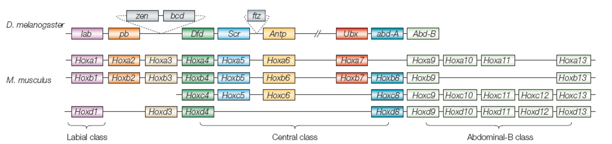
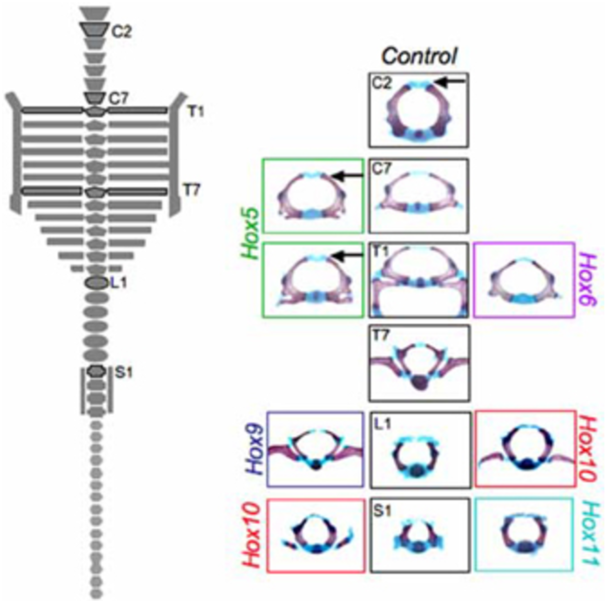
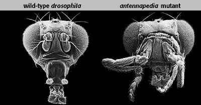
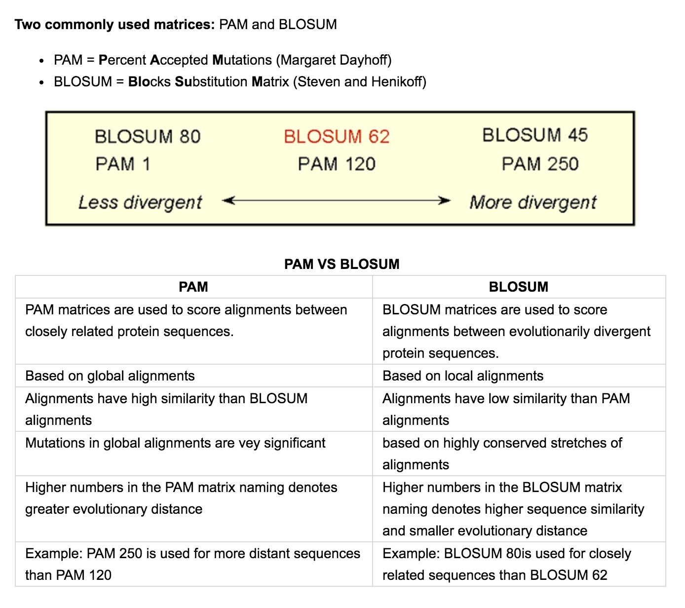
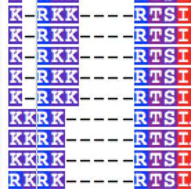
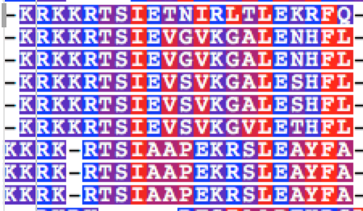
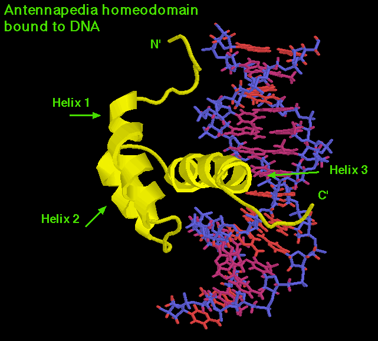
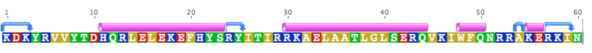
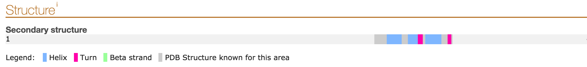

# Homeobox gene family investigation
Prepared for Bio 224 at CSU Sacramento by Clayton Visger


## What are homeobox genes?
> Homeobox genes are a large family of similar genes that direct the formation of many body structures during early embryonic development. In humans, the homeobox gene family contains an estimated 235 functional genes and 65 pseudogenes (structurally similar genes that do not provide instructions for making proteins). Homeobox genes are present on every human chromosome, and they often appear in clusters. Many classes and subfamilies of homeobox genes have been described, although these groupings are used inconsistently.


source: `Pearson, J. C. et al. 2005`

>Genes in the homeobox family are involved in a wide range of critical activities during development. These activities include directing the formation of limbs and organs along the anterior-posterior axis (the imaginary line that runs from head to tail in animals) and regulating the process by which cells mature to carry out specific functions (differentiation). Some homeobox genes act as tumor suppressors, which means they help prevent cells from growing and dividing too rapidly or in an uncontrolled way.


source: `Wellik 2007`
>Because homeobox genes have so many important functions, mutations in these genes are responsible for a variety of developmental disorders. For example, mutations in the HOX group of homeobox genes typically cause limb malformations. Changes in PAX homeobox genes often result in eye disorders, and changes in MSX homeobox genes cause abnormal head, face, and tooth development. Additionally, increased or decreased activity of certain homeobox genes has been associated with several forms of cancer later in life.

source: https://ghr.nlm.nih.gov/primer/genefamily/homeoboxes


In short: Homeobox genes are important and crazy things can happen when they are broken, silenced, etc

e.g.,  Flies with legs instead of antennas


Additional reading: https://www.nature.com/scitable/topicpage/hox-genes-in-development-the-hox-code-41402

## Dataset
In this lab you will investigate the HOXL and POU homeobox subfamilies.

For the sake of completeness, we will only use sequences from the following model organisms: Human	Mouse	Chicken	Zebrafish	Frog	Amphioxus	Fruitfly  Beetle	Honeybee	Nematode

To access the data you can either:
```
git clone https://github.com/cvisger/Homeobox_dataset
```
or download it yourself from the source http://homeodb.cbi.pku.edu.cn/download.get


## Goals
* Use Geneious to visualize multiple sequence alignments
* Consider the impact of different AA substitutions.
* Build gene family phylogenies and understand the impact of the alignment
* Identify orthologous and paralogous relationships
* Predict protein secondary structure

## Loading sequences into Geneious
Geneious is a graphical interface that houses a number of useful software, making it well suited to small scale phylogenetic analyses.  Oftentimes however, large genomic datasets are just going to bog it down, making it not very feasible for current NGS applications.

To get started make a new folder in the genious sidebar for today and name it whatever you'd like.

Drag and drop your POU.fasta file from /data into your new folder and it should load (if it asks, I recomend keeping them grouped together).

Take a moment and look at the sequences.  Explore the data, zoom in, zoom out, change the color format, etc. POU should have 110 sequences.

Since the data are amino acid sequences.  We can color them by different properties.  E.g., polarity or hydrophobicity.
Even those these sequences are not yet aligned. It should be clear that they share some similarities.

### Homeodomain
>Homeobox genes contain a particular DNA sequence that provides instructions for making a string of 60 protein building blocks (amino acids) known as the homeodomain. Most homeodomain-containing proteins act as transcription factors, which means they bind to and control the activity of other genes. The homeodomain is the part of the protein that attaches (binds) to specific regulatory regions of the target genes.

A homeobox is about 180 base pairs long. It encodes a protein domain (the homeodomain) which when expressed (i.e. as protein) can bind DNA. The following shows the consensus 60-residue chain corresponding to homeobox domain, with typical intron positions noted with dashes:
`RRRKRTA-YTRYQLLE-LEKEFLF-NRYLTRRRRIELAHSL-NLTERHIKIWFQN-RRMK-WKKEN`

Comparing the homeobox domain to our sequences you should see that the first exon is well conserved across POU.

`source: https://ghr.nlm.nih.gov/primer/genefamily/homeoboxes
https://en.wikipedia.org/wiki/Homeobox`

## Multiple sequence alignments
Select your POU sequences and click align/assemble -> multiple align.  From here you can use the Geneious alignment, MUSCLE, and even Clustal (which we used in a previous lab).

Choose either Geneious, Clustal, or MAAFT (goto tools and isntall the Maaft plugin) and run a few alignments, trying a few different cost matrixes (Use both BLOSUM and PAM).  Also try playing with Gap open/extension penalties to try and get the best alignment you can.

Some will clearly be better than others.  I recommend using the hydrophobicity and polarity color schemes while evaluating your alignments.



Once you have an alignment you are happy with make sure to write down the settings you used.

```

```

## Tree building
Goto tools and install the PHYML plugin

Select your favorite alignment and click tree -> PHYML
* choose the BLOSUM62 substitution model
* With no branch support(normally we do bootstrap, but you'll run out of time)
* repeat for one of a worse alignments

When it's done, check out the tree in geneious.  

Try out the different ways to represent the tree, tradition, circle tree, etc.  

Tweaking the zoom and expansion settings will help you better look at the tree.  You can also use transform to alter the branch lengths (proportional to site changes, equal, etc)

You can use the naming scheme to get an idea of how genes should be related (POU6 should ideally group together for example)

Click the alignment tab in the tree viewer.  This is very helpful to see if any issues in your alignment are causing spurious relationships to be inferred.  If you look at your worse alignment tree, I bet you can find areas where this is the case.

Find an area in your worse tree/alignment that needs fixing, and even if you can't do this anyway.

Go to the original alignment and click allow editing.  You can now edit the alignment.  Typically this involves changing gaps.

For e.g., here is an area of an alignment where the gaps might not be right.

Before:



After:




>Phylogenetics traditionally follows Occam's razor (or Ockham's razor) is a principle from philosophy. Suppose there exist two explanations for an occurrence. In this case, the simpler one is usually better. Another way of saying it is that the more assumptions you have to make, the more unlikely an explanation is.

Which of the two alignments is more likely? One where numerous base changes and deletions/additions all occured and eventually became fixed.  Or one where just a few minor changes accumulated?

After editing an alignment, rebuild the tree and see if the placement of the sequences you edited moved to a more appropriate place.

## HOX protein structure


The homeodomain has a secondary structure made up of a series of helices.

Because we are working with amino acid sequences we can try to predict these secondary structures in Geneious.

Select your alignment and use the annotate/predict drop down menu to predict secondary structure (just do helix or helix+turns).  After a bit of thinking you should have something similar to the image below for all of your sequences.



The predicitons are far from perfect, but you should be able to look some of them up for yourself.

For example, human Pou2F2:




The predicted helices in purple actually match the actual secondary structure somewhat.  You should also notice, that we have been working with a small fraction of the whole hox genes.  We have only been working with the coding sequences translated into Amino Acid.  

If we were working with nucleotide data and included introns, what do you think would happen to our alignments?

```
```

## Paralogues and Orthologues

Look through your final, and best tree.  Find as many instances where you would expect orthology based on the naming scheme (Pou3 should be orthologous to other Pou3), but observe paralogy as you can.

On the board, list your alignment settings, and which Pou genes were showing up as paralogous to similarly named genes (list the gene name and the group it is nested within e.g., Pou2f2 nested within Pou6).

Time permitting, we will see if we can find any genes that are consistently showing an evolutionary pattern in conflict with the naming scheme.
